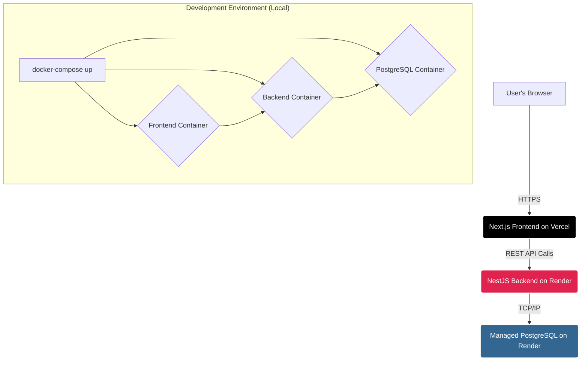

# PostThread: A Full-Stack Discussion Platform


**PostThread** is a modern, full-stack, and highly scalable discussion application built with a focus on backend performance, clean architecture, and a seamless user experience. Inspired by platforms like Twitter and Threads, it allows users to create posts, engage in deeply nested conversations, and receive real-time notifications. The entire application is containerized with Docker for consistent development and production environments and is deployed using a modern CI/CD workflow with Vercel and Render.

**Live Demo:** [**https://comment-app-murex.vercel.app/**](https://comment-app-murex.vercel.app/)

---

## ✨ Core Features

- **Secure User Authentication:** JWT-based authentication for user registration and login, with hashed passwords using `bcryptjs`.
- **Post & Reply System:** Users can create top-level posts and reply to any post or comment, creating deeply nested conversation threads.
- **Time-Limited Editing:** Users have a 15-minute window to edit their posts and comments after creation, preventing abuse.
- **Soft Deletes & Restore:** A 15-minute grace period allows users to restore their deleted posts or comments.
- **Real-Time Notifications:** Users receive notifications when another user replies to their post or comment. A real-time badge indicates unread notifications.
- **Robust Validation:** The backend uses `class-validator` to ensure all incoming data is secure and well-formed.
- **Scalable Architecture:** Built with a modular backend and a performant frontend, designed to handle heavy loads.
- **Automated Cleanup:** A scheduled background job (`@nestjs/schedule`) runs daily to permanently remove posts that were soft-deleted more than 30 days ago, ensuring database health.

---

## 🏗️ System Architecture

This project utilizes a modern, decoupled, and scalable architecture. The frontend is hosted on Vercel for optimal performance and global delivery, while the backend and database are managed by Render for reliability and ease of maintenance.



---

## 🛠️ Tech Stack

This project is built with a modern and powerful set of technologies, chosen for performance, scalability, and developer experience.

| Category       | Technology                                                                                                                                                                                                                                                                                                                                                                                                                                             |
| :------------- | :----------------------------------------------------------------------------------------------------------------------------------------------------------------------------------------------------------------------------------------------------------------------------------------------------------------------------------------------------------------------------------------------------------------------------------------------------- |
| **Frontend**   |     |
| **Backend**    |                                                 |
| **Deployment** |                                                                                                                                         |

---

## 🚀 Getting Started

To get a local copy up and running, follow these simple steps.

### Prerequisites

- **Docker** and **Docker Compose** must be installed on your machine.
- A code editor like **VS Code**.

### Local Development Setup

1.  **Clone the repository:**

    ```sh
    git clone [https://github.com/your-username/your-repo-name.git](https://github.com/your-username/your-repo-name.git)
    cd your-repo-name
    ```

2.  **Set up Backend Environment Variables:**
    Navigate to the `backend` directory and create a `.env` file. Copy the contents of `.env.example` (if you have one) or add the following:

    ```env
    # backend/.env
    DATABASE_HOST=db
    DATABASE_PORT=5432
    DATABASE_USERNAME=user
    DATABASE_PASSWORD=password
    DATABASE_NAME=nestjs_comments_db
    JWT_SECRET=a-very-strong-secret-for-local-development
    PORT=3000
    ```

3.  **Set up Frontend Environment Variables:**
    Navigate to the `frontend` directory and create a `.env.local` file with the following content:

    ```env
    # frontend/.env.local
    NEXT_PUBLIC_API_URL=http://localhost:3000
    ```

4.  **Build and Run with Docker Compose:**
    From the **root directory** of the project, run the following command:

    ```sh
    docker-compose up --build
    ```

    This command will build the Docker images for both the frontend and backend and start all the necessary containers.

5.  **Access the Application:**
    - Frontend: [http://localhost](http://localhost)
    - Backend API: [http://localhost:3000](http://localhost:3000)

---

## ☁️ Deployment

This application is deployed using a modern CI/CD pipeline:

- **Frontend (Next.js):** Deployed on **Vercel**. Vercel is connected to the `main` branch of the GitHub repository. Every push to `main` automatically triggers a new build and deployment.
- **Backend (NestJS) & Database (PostgreSQL):** Deployed on **Render**. The backend is deployed as a Dockerized Web Service, and the database is a managed PostgreSQL instance. This setup ensures a clear separation of concerns and leverages the strengths of each platform.

---

## 📜 API Endpoints Overview

<details>
<summary><strong>Click to expand API Endpoints</strong></summary>

| Method   | Endpoint                  | Description                                   | Protected |
| :------- | :------------------------ | :-------------------------------------------- | :-------- |
| `POST`   | `/auth/register`          | Register a new user.                          | No        |
| `POST`   | `/auth/login`             | Log in an existing user, returns JWT.         | No        |
| `GET`    | `/comments`               | Get all top-level posts.                      | No        |
| `GET`    | `/comments?parentId=:id`  | Get all replies for a specific post/comment.  | No        |
| `GET`    | `/comments/:id`           | Get a single post or comment by its ID.       | No        |
| `POST`   | `/comments`               | Create a new post or reply.                   | Yes       |
| `PATCH`  | `/comments/:id`           | Edit a post or comment.                       | Yes       |
| `DELETE` | `/comments/:id`           | Soft delete a post or comment.                | Yes       |
| `POST`   | `/comments/:id/restore`   | Restore a soft-deleted post or comment.       | Yes       |
| `GET`    | `/notifications/all`      | Get all notifications for the logged-in user. | Yes       |
| `GET`    | `/notifications/unread`   | Get unread notifications for the user.        | Yes       |
| `POST`   | `/notifications/:id/read` | Mark a notification as read.                  | Yes       |

</details>

---

## 👤 Author

**DARSHAN S**

- GitHub: [@darshan0106](https://github.com/darshan0106)
- LinkedIn: [linkedin.com/in/Darshan Sivakumar](https://www.linkedin.com/in/darshan-sivakumar-a45503225)

Feel free to reach out if you have any questions or feedback!
